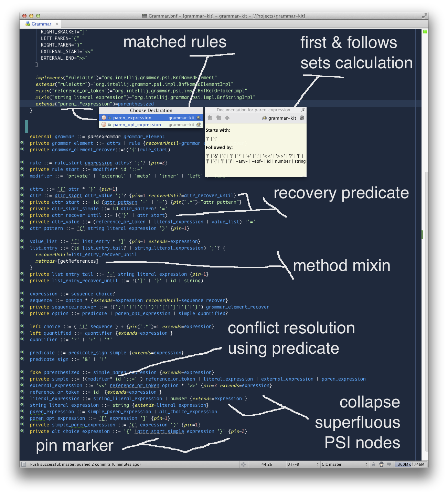

Grammar-Kit
===========
[/statusIcon.svg?guest=1)](https://teamcity.jetbrains.com/viewType.html?buildTypeId=IntellijIdeaPlugins_GrammarKit_Build&guest=1)
[](http://www.apache.org/licenses/LICENSE-2.0)
[](https://confluence.jetbrains.com/display/ALL/JetBrains+on+GitHub)

An [IntelliJ IDEA plugin](http://plugins.jetbrains.com/plugin/6606) for language plugin developers.<br>
Adds BNF Grammars and JFlex files editing support, and a parser/PSI code generator.

Quick links: [Latest dev build](https://teamcity.jetbrains.com/guestAuth/app/rest/builds/buildType:IntellijIdeaPlugins_GrammarKit_Build,status:SUCCESS/artifacts/content/GrammarKit*.zip),
[Changelog](CHANGELOG.md), [Tutorial](TUTORIAL.md), [How-to](HOWTO.md)

> **Note**
>
> Since 2022.3, Grammar-Kit plugin requires Java 17.

Open-source plugins built with Grammar-Kit:

* [Clojure-Kit](https://github.com/gregsh/Clojure-Kit), 
  [intellij-rust](https://github.com/intellij-rust/intellij-rust),
  [intellij-erlang](https://github.com/ignatov/intellij-erlang),
  [go-lang-idea-plugin](https://github.com/go-lang-plugin-org/go-lang-idea-plugin),
* [intellij-haskforce](https://github.com/carymrobbins/intellij-haskforce), 
  [elm-plugin](https://github.com/durkiewicz/elm-plugin),
  [intellij-elixir](https://github.com/KronicDeth/intellij-elixir),
  [Perl5-IDEA](https://github.com/Camelcade/Perl5-IDEA),
* [Dart](https://github.com/JetBrains/intellij-plugins/tree/master/Dart), 
  [intellij-haxe](https://github.com/JetBrains/intellij-haxe),
  [Cypher](https://github.com/neueda/jetbrains-plugin-graph-database-support),
  [OGNL](https://github.com/JetBrains/intellij-plugins/tree/master/struts2)

General usage instructions
--------------------------
1. Create grammar \*.bnf file, see [Grammar.bnf](grammars/Grammar.bnf) in the plugin code.
2. Tune the grammar using _Live Preview_ + Structure view (Ctrl-Alt-P / Cmd-Alt-P)
3. Generate parser/ElementTypes/PSI classes (Ctrl-Shift-G / Cmd-Shift-G)
4. Generate lexer \*.flex file and then run JFlex generator (both via context menu) 
5. Implement ParserDefinition and add the corresponding registrations to the plugin.xml
6. Mix-in resolve and other non-trivial functionality to PSI

Using with Gradle
-----------------

Invoking the parser generator from an IDE as described above is the preferred way.<br/>
Otherwise use [gradle-grammar-kit-plugin](https://github.com/JetBrains/gradle-grammar-kit-plugin) if the following limitations are not critical:

* Method mixins are not supported (two-pass generation is not implemented)
* Generic signatures and annotations may not be correct


Plugin features
===============



* Refactoring: extract rule (Ctrl-Alt-M/Cmd-Alt-M)
* Refactoring: introduce token (Ctrl-Alt-C/Cmd-Alt-C)
* Editing: flip _choice_ branches intention (via Alt-Enter)
* Editing: Unwrap/remove expression (Ctrl-Shift-Del/Cmd-Shift-Del)
* Navigation: quick grammar and flex file structure popup (Ctrl-F12/Cmd-F12)
* Navigation: go to related file (parser and PSI) (Ctrl-Alt-Home/Cmd-Alt-Home)
* Navigation: navigate to matched expressions (Ctrl-B/Cmd-B inside attribute pattern)
* Highlighting: customizable colors (via Settings/Colors and Fonts)
* Highlighting: pinned expression markers (tooltip shows pin value in charge)
* Highlighting: a number of inspections, the list is available in Settings/Inspections
* Documentation: rule documentation popup shows FIRST/FOLLOWS/PSI content (Ctrl-Q/Cmd-J)
* Documentation: attribute documentation popup (Ctrl-Q/Cmd-J)
* [Live preview](TUTORIAL.md): open language live preview editor (Ctrl-Alt-P/Cmd-Alt-P)
* [Live preview](TUTORIAL.md): start/stop grammar evaluator highlighting (Ctrl-Alt-F7/Cmd-Alt-F7 in preview editor)
* Generator: generate parser/PSI code (Ctrl-Shift-G/Cmd-Shift-G)
* Generator: generate custom _parserUtilClass_ class
* Generator: generate \*.flex - JFlex lexer definition
* Generator: run JFlex generator on a \*.flex file
* Diagram: PSI tree diagram (UML plugin required)


Syntax overview
===============
See [Parsing Expression Grammar (PEG)](http://en.wikipedia.org/wiki/Parsing_expression_grammar) for basic syntax.
Use ::= for ← symbol. You can also use [ .. ] for optional sequences and { | | } for choices as these variants are popular in real-world grammars.
Grammar-Kit source code is the main example of Grammar-Kit application.
The grammar for BNF parser and PSI generation can be found [here](grammars/Grammar.bnf).

Here's how it may look like:

````
// Basic PEG BNF syntax

root_rule ::= rule_A rule_B rule_C rule_D                // sequence expression
rule_A ::= token | 'or_text' | "another_one"             // choice expression
rule_B ::= [ optional_token ] and_another_one?           // optional expression
rule_C ::= &required !forbidden                          // predicate expression
rule_D ::= { can_use_braces + (and_parens) * }           // grouping and repetition

// Grammar-Kit BNF syntax

{ generate=[psi="no"] }                                  // top-level global attributes
private left rule_with_modifier ::= '+'                  // rule modifiers
left rule_with_attributes ::= '?' {elementType=rule_D}   // rule attributes

private meta list ::= <<p>> (',' <<p>>) *                // meta rule with parameters
private list_usage ::= <<list rule_D>>                   // meta rule application
````

The basic syntax is extended with global attributes and rule attributes.
Attributes are specified by the list of *name=value* pairs enclosed in braces.
Rule attributes are placed right after the rule definition.
Global attributes are placed on top or separated from a rule definition with a semicolon.

Generator generates a static method for each BNF expression as follows:
```
static boolean rule_name(..)               // rule top level expression
static boolean rule_name_0(..)             // rule sub-expression
...                                        // ...
static boolean rule_name_N1_N2_..._NX      // rule sub-sub-...-sub-expression
```
Naming a rule like *rule_name_N1_N2_..._NX* shall be avoided.

One can specify an attribute for several rules at once in a global attributes block:

````
{
  extends(".*_expr")=expr        // applies to all .*_expr rules
  pin(".*_list(?:_\d+)*")=1      // applies to all .*_list rules and their sub-expressions
}
````

### Rule modifiers:

1. *private* (PSI tree): skip node creation and let its child nodes be included in its parent. 
2. *left* (PSI tree):  take an AST node on the left (previous sibling) and enclose it by becoming its parent. 
3. *inner* (PSI tree):  take an AST node on the left (previous sibling) and inject itself into it by becoming its child.
4. *upper* (PSI tree):  take the parent node and replace it by adopting all its children.

5. *meta* (parser):  a parametrized rule; its parse function can take other parse functions as parameters.
6. *external* (parser):  a rule with a hand-written parse function; no parsing code is generated. 
   
7. *fake* (PSI classes):  a rule for shaping the generated PSI classes; only PSI classes are generated.

Modifiers can be combined, *inner* should only be used together with *left*,
*private left* is equivalent to *private left inner*, 
*fake* should not be combined with *private*.

By default, rules are *public*, i.e. *non-private*, *non-fake*, etc.

### Meta rules & external expressions:
The external expression *<< ... >>* is simply an inline variant of an external rule. It can also be used to specify a meta rule along with arguments.

For example:

````
meta comma_separated_list ::= <<param>> ( ',' <<param>> ) *
option_list ::= <<comma_separated_list (OPTION1 | OPTION2 | OPTION3)>>
````

External rule expression syntax is the same as a body of external expression:

````
 external manually_parsed_rule ::= methodName param1 param2 ...
````

External expressions and external rules interpret double- and single-quoted strings differently.
Generally, anything that appears in an external expression after rule or method name is treated
as a parameter and passed "as is" except single-quoted strings which are unquoted first.
This helps to pass qualified enum constants, java expressions, etc.

Rule references in parameter list are implemented as [GeneratedParserUtilBase.Parser](src/org/intellij/grammar/parser/GeneratedParserUtilBase.java) instances.

### Tokens:
Explicit tokens are declared via _tokens_ global attribute, e.g. in *token_name=token_value* form. 
A token name is for the IElementType token constant, a token value is usually its string representation in single or double-quotes.

Tokens in grammar can be referenced by name or by value in single or double-quotes.
It is recommended to use values where possible for better readability.
Names can be used to resolve conflicts when there is an unquoted token value that also matches some rule.

Implicit tokens are tokens not specified via _tokens_ attribute.
Unquoted implicit tokens (aka keyword tokens) have names equals to their values.
Quoted implicit tokens (aka text-matched tokens) are slow because they are matched by text and not by an IElementType constant returned by a lexer.
Text-matched tokens can span more than one real token returned by the lexer.

Rules, tokens, and text-matched tokens have different colors.

### Attributes for error recovery and reporting:
* _pin_ (value: a number or pattern) tunes the parser to handle incomplete matches. 
A sequence matches if its prefix up to a pinned item matches.
On successfully reaching the pinned item the parser tries to match the rest items whether they match or not.
Pin value indicates the desired item by either a number *{pin=2}* or pattern  *{pin="rule_B"}*.
By default, the pin is applied to the top sequence expression. Sub-expressions can be included using a target pattern:
*{pin(".\*")=1}* applies to all sub-sequences.

* _recoverWhile_ (value: predicate rule) matches any number of tokens after the rule
matching completes with any result. This attribute helps the parser recover when an unmatched token
sequence is encountered. See [HOWTO section](HOWTO.md#22-using-recoverwhile-attribute) for more.

* _name_ (value: string) specifies a name for a rule to be used in error reports. For example, *name("_.*expr")=expression* changes
expression error messages to "&lt;expression&gt; required" instead of a long list of tokens.

### Generated parser structure:
The generator can split parser code into several classes for better support of large grammars.

In simple cases, a parser will consist just of several generated classes.

The actual error recovery and reporting code as well as the parser-based completion provider support code and the basic token matching code reside
in a _parserUtilClass_ class. It may be altered by specifying some other class that extends or mimics the original [GeneratedParserUtilBase](src/org/intellij/grammar/parser/GeneratedParserUtilBase.java).
There's no need to keep a copy of GeneratedParserUtilBase in a project, it is included in *IntelliJ Platform* since version 12.1.

The manual parsing code, i.e. _external_ rules must be implemented the same way as generated, by a static method in the _parserUtilClass_ class or any other class that will
be imported via _parserImports_ attribute like this:
````
{
  parserImports=["static org.sample.ManualParsing.*"]
}
````

### Lexer and PSI:
IElementType constants generated by the parser generator have to be recognized and returned by the lexer.
The JFlex-based lexer can be generated from a grammar that defines all the required tokens ( *Generate JFlex Lexer* menu).

*Run JFlex Generator* menu in a \*.flex file calls JFlex to generate lexer java code.
Keywords are picked right from usages while tokens like *string*, *identifier* and *comment* can be defined like this (from [TUTORIAL](TUTORIAL.md)):

````
{
  tokens=[
    ...
    comment='regexp://.*'
    number='regexp:\d+(\.\d*)?'
    id='regexp:\p{Alpha}\w*'
    string="regexp:('([^'\\]|\\.)*'|\"([^\"\\]|\\.)*\")"
    ...
  ]
  ...
}
````

While *Live Preview* mode supports full Java RegExp syntax and JFlex supports only a subset (see [JFlex documentation](http://jflex.de/manual.html#SECTION00053000000000000000))
Grammar-Kit tries to perform some obvious conversions.

The lexer can be provided separately or one can use the generated \*.flex file as a base.

Parser generator generates token types constants and PSI by default.
This can be switched off via *generateTokens* and *generatePSI* global boolean attributes respectively.
 
*elementType* rule attribute allows mixing the generated code and some existing hand-made PSI.   
