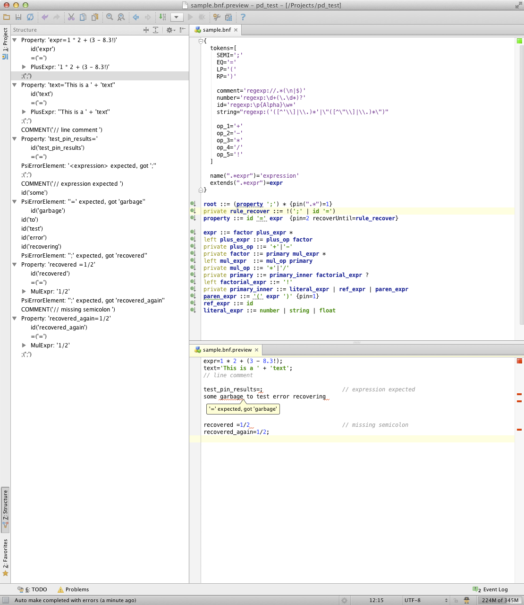

On how to read grammars
=======================

BNF grammars are pretty easy to read. Just replace the *::=* sign with *is* or *matches*.
We can easily include error recovery attributes to this verbalisation as well:
```
paren_expr ::= '(' expr ')' {pin=1}
```
can be read like that: _paren_expr_ matching is considered successful even if only '(' is actually matched.
Originally parser would stop matching on any failure.
Later the idea evolved into _extendedPin_ mode (ON by default) when parser tries to match the rest parts of a sequence no matter what,
i.e. ')' token will be matched in the case of " (  ) " input. It still stops matching on first failure if the _pinned_ part is not reached.

Thus the notion of _pin_ helps parser to recover when input misses some parts.
```
property ::= id '=' expr  {pin=2 recoverWhile=rule_recover}
private rule_recover ::= !(';' | id '=')
```
can be read like that: _property_ matches the sequence of _id_, '=' and _expr_.
The matching is considered successful if we get through '=' part.
And **regardless** of the result skip all the tokens while _rule_recover_ matches, i.e. while the parser doesn't encounter ';' or a rule start (id and '=').
Note that recovery rule is always a _predicate_ (a NOT predicate usually) hence it doesn't consume anything from the input.

Thus the notion of _recoverWhile_ helps parser to recover when input includes something unexpected.

Live Preview introduction
=========================

Suppose we want to create a grammar for some expression language like this:
````
expr=1 * 2 + (3 - 8.3!);
text='This is a ' + 'text';
// line comment

test_pin_results=;                        // expression expected
some garbage to test error recovering


recovered =1/2                            // missing semicolon
recovered_again=1/2;
````

To do this lets make a new file _sample.bnf_.
We can invoke *Live Preview* action via context menu or the ctrl-alt-P/meeta-alt-P shortcut and paste the sample text above right on start.

_Structure_ toolwindow, _File Structure_ popup (ctrl-F12/meta-F12) and _PSI Viewer_ dialog can be used to observe the PSI tree as we modify the grammar.

_Start/Stop Grammar Highlighting_ action (ctrl-alt-F7/meta-alt-F7) highlights grammar expressions at the current caret position in a preview editor.


In the end my IDE looked like that:




Here is the grammar I designed for the sample above. No java coding, no generation, no test running.
I still need to add a lexer and some extra attributes to generate a real parser like package and some class
names as described in the [main readme](README.md) but now I'm sure the BNF part is OK.

The initial `*.flex` file and `*.java` lexer can be generated using editor context menu items.

The fun part is that I even can _inject_ this language in some other files I work with to quickly test the syntax.

Summary
================

The described workflow can be summarized as follows:

1. prototype the grammar in *LivePreview*
2. generate initial `*.flex` to sources and generate a `*.java` lexer from it
3. create *ParserDefinition* and/or setup lexer and parser tests
4. perfect the `*.flex` & `*.bnf` separately in production environment

*Note 1:* Flex file shall be edited manually as it is likely to contain complex logic that is absent in `*.bnf`.
This also implies that *LivePreview* is not useful at (4) as it requires supporting 2 different lexers.

*Note 2:* Whitespaces and comments declared in a *ParserDefinition* are skipped by *PsiBuilder*.
To mimic this behavior the *LivePreviewLexer* treats as whitespace any space or new-line matching *regexp* token
that is not used anywhere in the rules.


Full sample.bnf text:
````
{
  tokens=[
    SEMI=';'
    EQ='='
    LP='('
    RP=')'

    space='regexp:\s+'
    comment='regexp://.*'
    number='regexp:\d+(\.\d*)?'
    id='regexp:\p{Alpha}\w*'
    string="regexp:('([^'\\]|\\.)*'|\"([^\"\\]|\\.)*\")"

    op_1='+'
    op_2='-'
    op_3='*'
    op_4='/'
    op_5='!'
  ]

  name(".*expr")='expression'
  extends(".*expr")=expr
}

root ::= root_item *
private root_item ::= !<<eof>> property ';' {pin=1 recoverWhile=property_recover}

property ::= id '=' expr  {pin=2}
private property_recover ::= !(';' | id '=')

expr ::= factor plus_expr *
left plus_expr ::= plus_op factor
private plus_op ::= '+'|'-'
private factor ::= primary mul_expr *
left mul_expr  ::= mul_op primary
private mul_op ::= '*'|'/'
private primary ::= primary_inner factorial_expr ?
left factorial_expr ::= '!'
private primary_inner ::= literal_expr | ref_expr | paren_expr
paren_expr ::= '(' expr ')' {pin=1}
ref_expr ::= id
literal_expr ::= number | string | float
````

Try playing with _pin_ and _recoverWhile_ attributes, tokens and rule modifiers to see how this all works.
